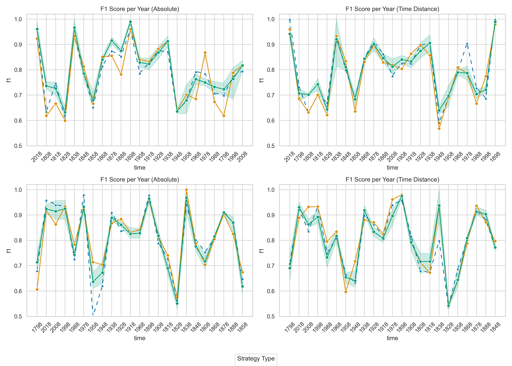

# Temporal NER

[](https://arxiv.org/abs/2606.27881)
[](https://www.python.org/)
[](https://pytorch.org/)
[](LICENSE)

**Temporal fusion strategies for named entity recognition in historical texts.**

This repository contains the code, data-processing utilities, experiments, and analysis material associated with:

> **A Study of Temporal Fusion Strategies for Named Entity Recognition in Historical Texts**  
> Emanuela Boros  
> [arXiv:2606.27881](https://arxiv.org/abs/2606.27881)

Historical named entities are not temporally stable: names, spellings, organizations, products, locations, and their relative prominence change over time. This project studies whether document dates can be integrated directly into Transformer-based NER models to improve robustness across historical periods.

<p align="center">
  
</p>

## Overview

The implementation extends multilingual Transformer token-classification models with lightweight temporal representations. It supports:

- **absolute and relative year encodings**;
- **early and late temporal fusion**;
- additive, concatenation, FiLM, adapter, multiscale, and cross-attention mechanisms;
- multilingual historical NER experiments on **French and German HIPE data**;
- token-level evaluation, per-entity analysis, yearly analysis, and temporal probing;
- optional Weights & Biases logging and distributed training utilities.

The experiments described in the paper show that temporal information can be useful, but its effect depends strongly on where and how it is injected. Late-fusion approaches are generally more robust, particularly for earlier and noisier historical periods.

## Repository structure

```text
.
├── temporal-ner/                 # Main temporal NER implementation
│   ├── main.py                   # Training and evaluation entry point
│   ├── models.py                 # NER models and temporal fusion modules
│   ├── dataset.py                # HIPE/CoNLL reader and label alignment
│   ├── probe.py                  # Temporal probing experiments
│   ├── postprocess.py            # Result aggregation and post-processing
│   ├── plots.py                  # Plotting utilities
│   ├── data/hipe2020/            # French, German, and English HIPE files
│   ├── experiments/              # Saved experiment metadata and statistics
│   ├── images/                   # Figures generated from the experiments
│   └── notebooks/                # Result-analysis notebooks
├── simple-ner/                   # Simpler NER baselines and prototypes
├── stacked-ner/                  # Stacked embedding NER experiments
├── old-stacked-ner/              # Some random stacked NER experiments
├── hf/                           # Hugging Face model configuration/code
├── HIPE-scorer_backup/           # Local copy of the HIPE evaluation utilities
├── results/                      # Selected result files
├── probing_results.tsv           # Aggregated probing results
└── LICENSE                       # GNU General Public License v3.0
```

The actively relevant implementation for the paper is under [`temporal-ner/`](temporal-ner/).

## Installation

A recent Python 3 environment is recommended. The repository does not currently pin package versions, so create an isolated environment before installing the dependencies.

```bash
git clone https://github.com/EmanuelaBoros/temporal-ner.git
cd temporal-ner

python -m venv .venv
source .venv/bin/activate        # Windows: .venv\Scripts\activate

python -m pip install --upgrade pip
pip install \
  torch \
  transformers \
  accelerate \
  peft \
  seqeval \
  pandas \
  numpy \
  tqdm \
  wandb \
  tensorboard \
  scikit-learn \
  matplotlib \
  jupyter
```

For GPU training, install the PyTorch build matching the CUDA version available on your system.

## Data format

The main loader expects HIPE-style tab-separated data with token-level NER annotations and document-level date metadata. Dates are read from lines such as:

```text
# hipe2022:date = 1888-01-09
```

The loader currently trains on the coarse literal NER task:

```text
NE-COARSE-LIT
```

The expected columns follow the HIPE format, including fields such as `TOKEN`, `NE-COARSE-LIT`, `NE-FINE-LIT`, `NE-NESTED`, and NEL-related annotations. Sequences are split on blank lines or `EndOfSentence` markers.

Example files are organized by language:

```text
temporal-ner/data/hipe2020/
├── de/
│   ├── HIPE-2022-v2.1-hipe2020-train-de.tsv
│   ├── HIPE-2022-v2.1-hipe2020-dev-de.tsv
│   └── HIPE-2022-v2.1-hipe2020-test-de.tsv
└── fr/
    ├── HIPE-2022-v2.1-hipe2020-train-fr.tsv
    ├── HIPE-2022-v2.1-hipe2020-dev-fr.tsv
    └── HIPE-2022-v2.1-hipe2020-test-fr.tsv
```

Please consult and respect the licenses and citation requirements of the original HIPE datasets.


